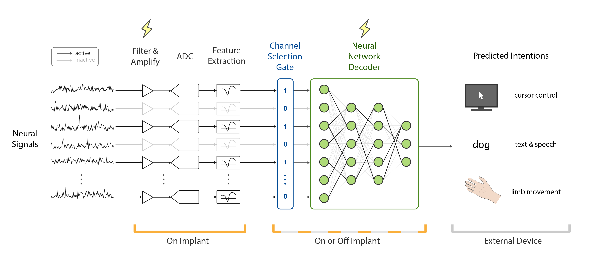

## Sparse neural networks enable low-power, implantable neural interfaces

## Overview

This repository contains the code for the paper "Sparse neural networks enable low-power, implantable neural interfaces".

See the example notebooks for pruning decoders and for performing pruning-based channel selection.

